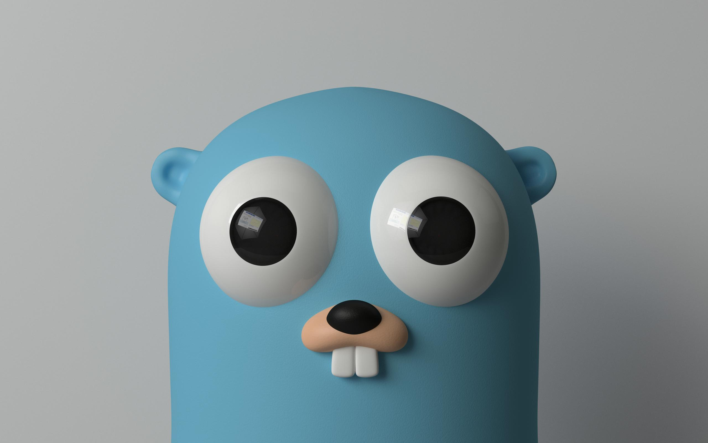

# Profile

[](https://github.com/project-aico/profile/blob/main/.github/workflows/release.yml)
[](https://github.com/project-aico/profile/commits/main/)
[](https://github.com/project-aico/profile/blob/main/LICENSE)

A simple command-line tool written in Go that transforms your photos into 8-bit retro-style pixel art.
It uses the Xterm 256 color palette and a pixelation algorithm to achieve a nostalgic "lo-fi" aesthetic.

## Features

- **Retro Aesthetic**: Converts images to use a limited 8-bit color palette (Xterm 256).
- **Pixelation**: Downsamples and then scales back up using Nearest Neighbor interpolation to create jagged, blocky pixels.
- **Format Support**: Reads and writes both PNG and JPEG formats.

## Installation

Ensure you have [Go](https://go.dev/) installed on your machine.

- Clone the repository:

   ```bash
   git clone https://github.com/project-aico/profile.git
   cd profile
   ```

- Build the binary:

   ```bash
   go build .
   ```

## Usage

```bash
$ ./profile --help
Usage: ./profile <input_image> <output_image>

Arguments:
  <input_image>   Path to the PNG or JPEG file you want to convert.
  <output_image>  Path where the 8-bit style image will be saved.

Flags:
  -h, --help      Show this help information.
```

## Examples

- The original image:

  

- The rendered image:

  

## License

This project is licensed under the GNU General Public License v3.0 (GPLv3).
See the [LICENSE](./LICENSE) file for details.
