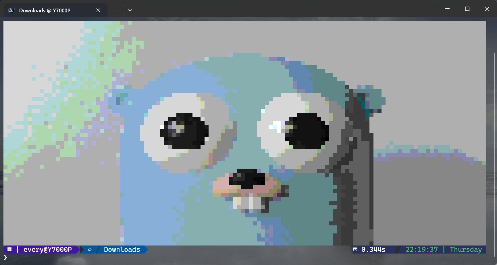

# Profile

[](https://github.com/project-aico/profile/blob/main/.github/workflows/release.yml)
[](https://github.com/project-aico/profile/commits/main/)
[](https://github.com/project-aico/profile/blob/main/LICENSE)

A Go CLI tool that renders images directly in the terminal with 256-color ANSI codes.

## Usage

```bash
$ ./profile
Usage: ./profile <the path to the image>
```

## Examples

- The original image:

    

- The image rendered in the terminal:

    
