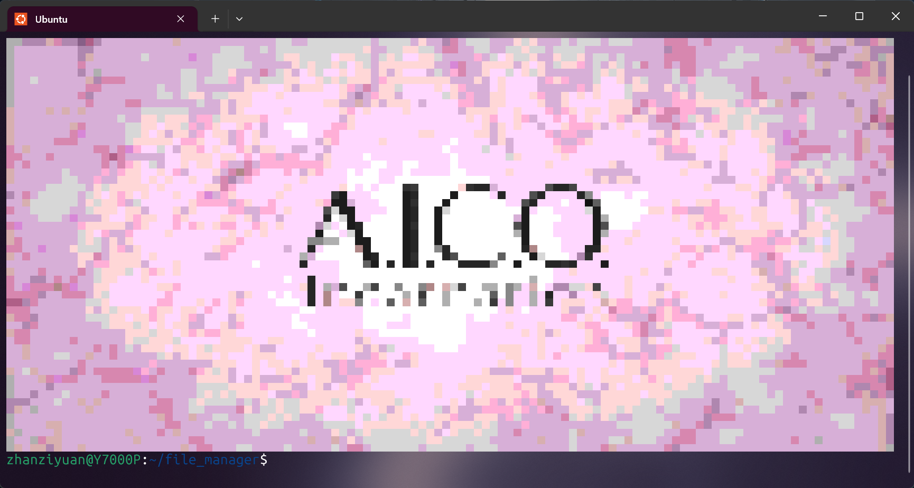

# Profile

A Go CLI tool that renders images directly in the terminal with 256-color ANSI codes.

## Usage

```bash
$ ./profile
Usage: ./profile <the path to the image>
```

## Examples

- The original image:

    

- The image rendered in the terminal:

    
